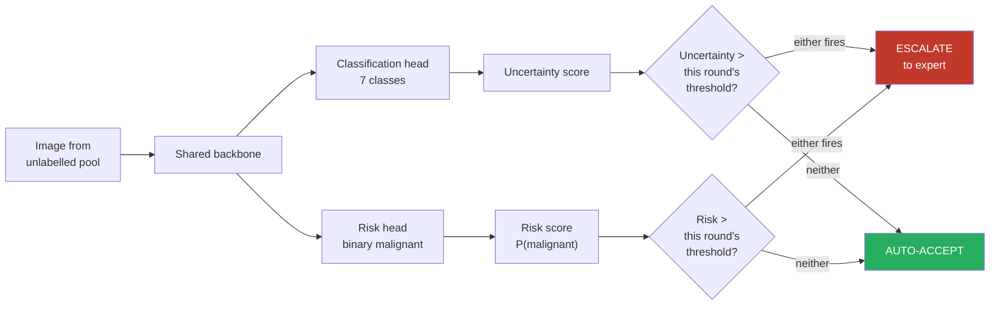

<h1 align="center">Risk-Aware Active Learning for Skin Lesion Classification<br>Using Dual-Metric Human-in-the-Loop Escalation</h1>

<p align="center">
  <em>A human-in-the-loop framework that catches the cancers a confident model waves through</em>
</p>

<p align="center">
  
  
  
  
  
</p>

<p align="center">
  Laiba Noor · <strong>Muhammad Dyen Asif</strong> · Haider Ramzan · Azka Atiq<br>
  Muhammad Atif Saeed · Akhtar Jamil · Ahmad Din<br>
  <sub>National University of Computer &amp; Emerging Sciences (FAST-NUCES), Islamabad</sub><br>
  <sub>Manuscript under peer review, 2026</sub>
</p>

---

## Where to start

| If you want… | Read |
|---|---|
| **What we found** | [`RESULTS.txt`](RESULTS.txt) |
| **How we compare to published methods** | [`paper/COMPARISON/README.txt`](paper/COMPARISON/README.txt) |
| **How to run it** | [`HOW_TO_RUN.txt`](HOW_TO_RUN.txt) |
| **The formal method** | [`METHODS.md`](METHODS.md) |
| **The figures and tables** | [`paper/README.txt`](paper/README.txt) |
| **The raw experiment output** | [`results/README.txt`](results/README.txt) |

---

## The problem

A skin-cancer classifier can be **confidently wrong on a dangerous case**. When a melanoma is
misread as a benign mole with high confidence, standard active learning sees a confident
prediction, auto-accepts it, and the patient never gets a second opinion.

Standard active learning asks one question — *how sure is the model?* It never asks the question a
clinician would ask second: *how dangerous is this case if the model is wrong?*

## The approach

Two independent signals, not one:

1. **Uncertainty** — how confident the model is, from the 7-class classification head
   (entropy, MC-dropout, margin, or least-confidence).
2. **Clinical risk** — `P(malignant)`, from a **dedicated binary risk head** trained on a shared
   backbone but with its own parameters and its own loss term.

A case is escalated to a human if **either** signal fires:

```
                        Low Risk              High Risk
                  ┌───────────────────┬───────────────────┐
  Low             │    AUTO-ACCEPT    │     ESCALATE      │
  Uncertainty     │  safe & efficient │  ← the whole point │
                  ├───────────────────┼───────────────────┤
  High            │    AUTO-ACCEPT    │     ESCALATE      │
  Uncertainty     │  efficiency gain  │  always reviewed  │
                  └───────────────────┴───────────────────┘
```

**Top-right is the cell that matters.** The model is *confident*, the case is *dangerous*. Every
standard method auto-accepts it. Ours forces expert review.

### Why the risk head is separate

An earlier version computed risk by summing the classifier's own high-risk probabilities,
`P(mel) + P(bcc) + P(akiec)`. That made risk a rearrangement of the very numbers uncertainty was
already reading — so when the classifier was confidently wrong about a melanoma it put little mass
on `mel`, and uncertainty *and* risk both came out low. Both signals failed on exactly the case the
method exists to catch.

The risk head is trained on the malignant/benign label directly, so it is free to disagree with the
classifier. Measured effect: the two score the same overall (AUROC 0.9555 vs 0.9558), but on images
the classifier gets *wrong* the head gains +0.025 AUC and flags 5.9% of missed cancers at threshold
0.5 against 0.9% for the summed version. On that subset both still fall below chance, because the
heads share a backbone and fail on the same hard images — this is documented rather than hidden, and
separating the backbones is the identified next step.

### Thresholds are recalibrated every round

Escalation thresholds are **not hardcoded**. At the start of every round the model scores its
current labelled set and takes the **90th percentile** as that round's threshold, separately for
uncertainty and for risk.

This corrects an earlier design that calibrated once in round 1 and reused those values. That version
failed measurably: a rapidly improving model stopped producing scores anywhere near a threshold set
against its weakest self, and escalation collapsed from 558 images to 1 to 0 by round 3, freezing the
labelled set for the remaining 12 rounds.

Uncertainty scores are therefore left on each method's own raw scale (entropy reaches ~1.95,
MC-dropout sits near 0) rather than squeezed into [0, 1] — per-round calibration is what makes a
single threshold meaningful across scores living on very different scales. See
`active_learning/al_loop.py::calibrate_thresholds()`.

---

## Results

**24 experiments** (ResNet-50, DenseNet-169, EfficientNet-B4 x entropy, margin, least-confidence, MC dropout x two policies), 15 rounds each, all scored on one frozen 1,905-image test set.

### Safety — 15 of 15 comparisons won

Cumulative high-risk cases auto-accepted without human review. Lower is better.

| Backbone | **Ours** | CoreSet | BADGE | CLUE | VAAL | Uncertainty-only |
|---|---|---|---|---|---|---|
| ResNet-50 | **4,945** | 9,575 | 8,194 | 8,481 | 12,628 | 9,327 |
| DenseNet-169 | **4,495** | 8,543 | 6,947 | 7,397 | 11,308 | 8,275 |
| EfficientNet-B4 | **7,362** | 9,893 | 10,963 | 11,873 | 12,745 | 12,346 |

**25.6% to 60.8% fewer, with no exceptions.** Against the uncertainty-only baseline specifically,
43.2% fewer, in 12 of 12 pairings.

### Accuracy — no penalty

Image-level McNemar over the 1,905 shared test images, Holm-corrected across all 15 comparisons:

| Comparison | Δ accuracy | Verdict |
|---|---|---|
| vs VAAL (3/3 backbones) | +2.6 to +5.4 pp | significantly better |
| vs Uncertainty-only (EfficientNet-B4) | +2.41 pp | significantly better |
| vs CoreSet, BADGE, CLUE | −0.68 to +1.52 pp | no detectable difference |

The non-significant rows are the intended result. CoreSet, BADGE and CLUE are built to maximise
learning per label; matching them at an identical budget while halving unsafe auto-accepts is the
finding.

### The comparison is cost-matched

The baselines are *acquisition strategies* given a budget; ours is an *escalation policy* that
chooses its own. Compared naively, whichever asks for more labels wins. Each baseline was therefore
given **exactly** the number of labels our policy spent in that same round on that same backbone —
verified exact for all 12 runs, and re-checked by the analysis script, which refuses to emit a table
if a single run deviates.

### What it costs, and what it does not show

- **Cost:** ~9% more oracle labels. At a *matched* budget our method is 0.35 pp *behind* on accuracy.
  This is a safety intervention with a quantified price, **not** a label-efficiency improvement.
- **Not shown:** the safety result is measured on the **unlabelled pool** — the cases the decision
  rule actually decides about, which is the right place to evaluate a decision rule. Held-out
  missed-cancer rate moved in the same direction but did **not** reach significance. Both numbers are
  real; they answer different questions.
- **Single seed** throughout, and two of the seven classes have too few test images (9 and 14) for
  trustworthy confidence intervals — flagged as such rather than quoted.

Full detail and every source file: [`RESULTS.txt`](RESULTS.txt).

---

## Experiment design

| Dimension | Options | Count |
|---|---|---|
| Backbone | ResNet-50, DenseNet-169, EfficientNet-B4 | 3 |
| Uncertainty method | entropy, MC-dropout, margin, least-confidence | 4 |
| Escalation policy | uncertainty-only (baseline), dual-metric (ours) | 2 |
| | | **24** |
| Published baselines | CoreSet, BADGE, CLUE, VAAL × 3 backbones | **12** |
| | | **36 total** |

| Split | Size | Role |
|---|---|---|
| Seed (labelled) | 490 (70 per class) | initial training data |
| Unlabelled pool | 7,620 | available for oracle queries |
| Test set | 1,905 | frozen, never trained on, identical across all 36 runs |

| Class | Name | Risk |
|---|---|---|
| `mel` | Melanoma | high |
| `bcc` | Basal cell carcinoma | high |
| `akiec` | Actinic keratoses | high |
| `nv` | Melanocytic nevi | low |
| `bkl` | Benign keratosis | low |
| `df` | Dermatofibroma | low |
| `vasc` | Vascular lesions | low |

| Hyperparameter | Value |
|---|---|
| Learning rate | 1e-4 |
| Batch size | 32 |
| Epochs per round | 10 |
| Image size | 224 × 224 |
| AL rounds | 15 |
| MC-dropout passes | 30 |
| Escalation thresholds | 90th percentile, recalibrated every round |
| Class weights | inverse-frequency on both heads, on by default |
| Seed | 42 (split seed frozen separately) |

### The oracle

Escalated images go to a simulated expert that returns the ground-truth diagnosis from the metadata
(`Oracle_Simulated_Doctor/oracle.py`). This is the standard construction in active-learning research
— it makes experiments reproducible while still modelling the human-in-the-loop workflow — and it is
stated as a limitation, since a simulated oracle is not a dermatologist.

---

## Architecture



---

## Repository layout

```
├── main.py                    entry point — CLI for running experiments
├── config.py                  hyperparameters, paths, defaults
├── constants.py               class definitions and risk mapping
├── HOW_TO_RUN.txt             installation, dataset setup, every command
├── RESULTS.txt                what we found, in plain language
├── METHODS.md                 the formal method
├── MANIFEST.csv               checksum for every artefact produced
│
├── data/                      dataset, transforms, labelled/unlabelled pools
├── models/                    ResNet-50, DenseNet-169, EfficientNet-B4
├── uncertainty/               the four uncertainty measures
├── risk_score/                the clinical risk score
├── escalation/                uncertainty-only and dual-metric policies
├── active_learning/           the AL loop; baselines/ holds the four published methods
├── Oracle_Simulated_Doctor/   the simulated expert
├── evaluation/                metrics, plots, and rigor/ — rigorous statistical checks
├── tools/                     manifest and package builders
├── colab/                     setup for running on a free cloud GPU
├── Seed Data/                 the 490 starting images and their ID list
│
├── results/                   raw per-round output of all 24 experiments
├── analysis/                  figures, tables and statistics computed from them
├── XAI_evaluation/            explainability pipeline (Grad-CAM++, EigenCAM, Score-CAM)
├── OOD_evaluation/            out-of-distribution evaluation framework
└── paper/                     publication-quality figures, tables, and COMPARISON/
```

Each of `results/`, `analysis/`, `paper/`, `paper/COMPARISON/` and `colab/` has a short `README.txt`
explaining what is inside it.

---

## Quick start

```bash
git clone https://github.com/DyneStein/RiskAware-ActiveLearning.git
cd RiskAware-ActiveLearning
pip install -r requirements.txt
```

Looking at the results needs nothing further — they are in `results/`, `analysis/` and `paper/` as
CSV and PNG.

Running experiments needs the HAM10000 images, which are **not redistributed here**
(see below), and a GPU:

```bash
export DATA_ROOT=/path/to/archive

python main.py --model resnet50 --uncertainty entropy --policy dual_metric --rounds 2  # smoke test
python main.py --run-all --resume                                                      # everything
```

`--resume` saves after every round and continues where it stopped, which is how the whole study was
run on free Colab sessions. Full reference: [`HOW_TO_RUN.txt`](HOW_TO_RUN.txt).

---

## Data and reproducibility

**The dataset is not included.** HAM10000 is licensed CC BY-NC and is 2.8 GB; it is downloaded
separately from [Harvard Dataverse](https://doi.org/10.7910/DVN/DBW86T). What *is* committed is
`Seed Data/seed_metadata.csv`, the list of image IDs forming the 490-image seed set — the ID list is
the scientific fact, and it reconstructs the seed set from any copy of HAM10000.

**Trained models are not included.** 36 checkpoints, 2.6 GB. Available on request and to be
published with a DOI at submission. `MANIFEST.csv` carries a SHA-256 for every artefact, so any copy
can be verified: `python -m tools.build_manifest --verify`.

**Two seeds, doing different jobs.** The split seed is frozen at 42 forever and decides the test set;
the training seed controls initialisation, batch order and augmentation. Freezing the first is what
makes all 36 runs paired on identical test images.

**Note on external validation.** ISIC 2019 *contains* HAM10000 with identifiers preserved, so it
cannot be used as-is — that would mean testing on training images. The submitted paper therefore
reports external validation on **14,885 ISIC 2019 images after removing the HAM10000 duplicates**,
giving an 83.3% accuracy win rate and a 75.0% melanoma-safety win rate across the 12 matched pairs.

---

## Authors

Laiba Noor, **Muhammad Dyen Asif**, Haider Ramzan, Azka Atiq, Muhammad Atif Saeed,
Akhtar Jamil, Ahmad Din.

National University of Computer & Emerging Sciences (FAST-NUCES), Islamabad.
Author order follows the byline of the submitted manuscript, which is currently under peer review.

The manuscript's author contribution statement records that authors 2 and 3 — Muhammad Dyen Asif
and Haider Ramzan — implemented the proposed methodology, conducted the experiments, and performed
the results analysis and interpretation.

## Citation

If you use this code, please cite the dataset:

> Tschandl, P., Rosendahl, C. & Kittler, H. The HAM10000 dataset, a large collection of
> multi-source dermatoscopic images of common pigmented skin lesions. *Scientific Data* **5**,
> 180161 (2018).

A citation for this work will be added when the paper is published.

## References

- Sener, O. & Savarese, S. Active Learning for Convolutional Neural Networks: A Core-Set Approach. *ICLR* (2018).
- Ash, J. et al. Deep Batch Active Learning by Diverse, Uncertain Gradient Lower Bounds. *ICLR* (2020).
- Prabhu, V. et al. CLUE: Clustering Uncertainty-weighted Embeddings for Active Domain Adaptation. *ICCV* (2021).
- Sinha, S., Ebrahimi, S. & Darrell, T. Variational Adversarial Active Learning. *ICCV* (2019).
- Gal, Y. & Ghahramani, Z. Dropout as a Bayesian Approximation. *ICML* (2016).
- Settles, B. Active Learning Literature Survey. *Technical Report 1648*, University of Wisconsin–Madison (2009).

## License

Code and results are released under the MIT License — see [`LICENSE`](LICENSE).

The HAM10000 images are **not redistributed here**. The two label tables that are
(`Seed Data/seed_metadata.csv` and the oracle's metadata CSV) are derived from HAM10000 and remain
under its CC BY-NC terms — see [`NOTICE.txt`](NOTICE.txt) for the full carve-out.

> **This is research code, not a medical device.** It has not been clinically validated or reviewed
> by any regulator, and must not be used to diagnose or treat anyone.
