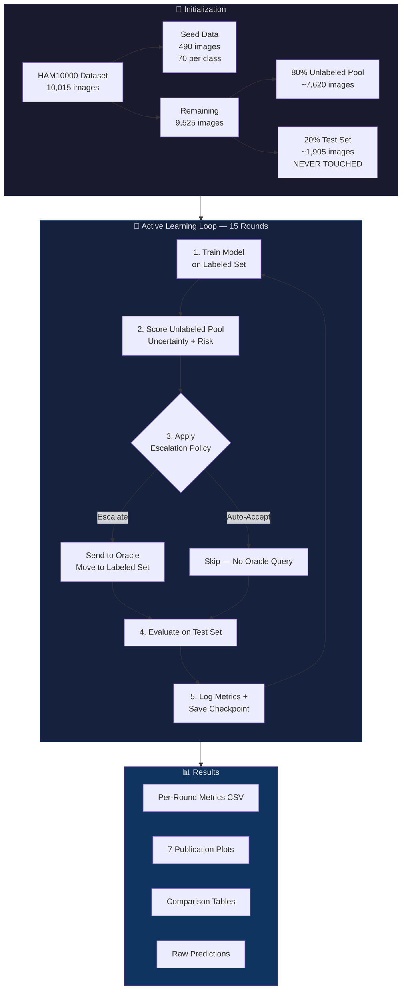
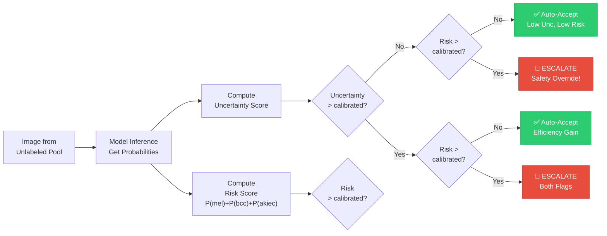
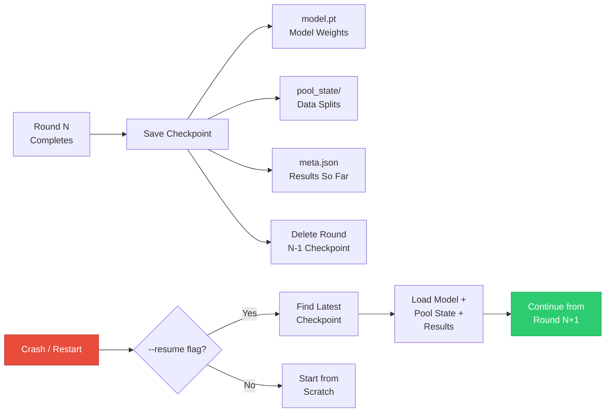

<p align="center">
  <h1 align="center">🩺 Risk-Aware Active Learning for Dermatological Image Classification</h1>
  <p align="center">
    <em>A Human-in-the-Loop Framework That Catches the Cancers AI Misses</em>
  </p>
  <p align="center">
    
    
    
    
    
  </p>
</p>

---

## 📌 The Problem

AI models for skin cancer detection can be **confidently wrong on dangerous cases**. When a melanoma image is misclassified as a benign mole with high confidence, standard active learning treats it as a "safe" prediction and auto-accepts it — **the patient never gets a second opinion**.

Standard active learning only considers **uncertainty** — "How sure is the model?" — but ignores **clinical risk** — "How dangerous is this case if the model is wrong?"

## 💡 Our Solution

We propose a **dual-metric escalation policy** that combines:

1. **Uncertainty Score** — How confident is the model? (entropy, MC dropout, margin, or least confidence)
2. **Clinical Risk Score** — Sum of predicted probabilities for high-risk classes: `P(melanoma) + P(BCC) + P(actinic keratosis)`

These two scores create a **2×2 decision grid** that catches the cases standard approaches miss:

```
                        Low Risk              High Risk
                  ┌───────────────────┬───────────────────┐
                  │                   │                   │
  Low             │   ✅ AUTO-ACCEPT  │   🚨 ESCALATE     │
  Uncertainty     │   Safe & efficient│   ← SAFETY        │
                  │                   │     OVERRIDE       │
                  ├───────────────────┼───────────────────┤
                  │                   │                   │
  High            │   ✅ AUTO-ACCEPT  │   🚨 ESCALATE     │
  Uncertainty     │   Efficiency gain │   Always send      │
                  │                   │   to expert        │
                  └───────────────────┴───────────────────┘
```

**The critical cell is top-right**: Low uncertainty + High risk. The model is *confident*, but the case is *dangerous*. The baseline auto-accepts these. **Our policy forces expert review — catching the cancers AI misses.**

> **Methodology note (seed-calibrated thresholds):** the 0.5 / 0.3 numbers above are illustrative only. In the actual code, thresholds are **not hardcoded** — after the model trains on the 490 seed images in round 1, it scores that same seed set and takes the **90th-percentile score** as the fixed escalation threshold for the rest of the run (separately for uncertainty and for risk). Uncertainty scores are also left in each method's own **raw, natural scale** (entropy can reach ~1.95, MC-dropout sits near 0) rather than being artificially squeezed into [0, 1] — calibration is what makes a single threshold meaningful across methods that live on very different scales. See `active_learning/al_loop.py::calibrate_thresholds()` and `proposed_changes.md` for the full rationale.

---

## 🏗️ Architecture & Workflow

### High-Level Experiment Flow



### Dual-Metric Decision Flow



---

## 📁 Project Structure

```
RiskAware-ActiveLearning/
│
├── main.py                          # 🚀 Entry point — CLI for running experiments
├── config.py                        # ⚙️ All hyperparameters, paths, thresholds
├── constants.py                     # 📋 Risk mappings, class definitions
├── create_seed_data.py              # 🌱 Script that created the 490-image seed set
├── RESEARCHER.md                    # 📖 Detailed guide on running experiments
├── README.md                        # 📄 This file
│
├── Seed Data/                       # 🌱 Initial labeled data (490 images + metadata)
│   ├── seed_metadata.csv            #    70 images × 7 classes, stratified
│   └── ISIC_*.jpg                   #    The actual dermoscopy images
│
├── Oracle_Simulated_Doctor/         # 👨‍⚕️ Simulated human expert
│   ├── oracle.py                    #    Looks up ground-truth labels
│   └── MetaData of Dataset (not seed data).csv
│
├── data/                            # 📦 Data loading & management
│   ├── dataset.py                   #    HAM10000Dataset (PyTorch Dataset)
│   ├── pool_manager.py              #    Manages labeled/unlabeled/test splits
│   └── transforms.py               #    Train & eval image transforms
│
├── models/                          # 🧠 Model architectures
│   ├── base_model.py                #    Base class: training, MC Dropout, checkpoints
│   ├── efficientnet.py              #    EfficientNet-B4 (ImageNet pretrained)
│   ├── resnet.py                    #    ResNet-50 (ImageNet pretrained)
│   ├── densenet.py                  #    DenseNet-169 (ImageNet pretrained)
│   └── model_factory.py             #    Factory function: name → model instance
│
├── uncertainty/                     # 🎯 Uncertainty estimation methods
│   ├── entropy.py                   #    Shannon entropy of softmax distribution
│   ├── mc_dropout.py                #    Monte Carlo Dropout (30 forward passes)
│   ├── margin.py                    #    Margin between top-2 predictions
│   ├── least_confidence.py          #    1 - max(softmax probability)
│   └── uncertainty_factory.py       #    Factory function: name → uncertainty fn
│
├── risk_score/                      # ⚠️ Clinical risk scoring
│   └── clinical_risk.py             #    Risk = P(mel) + P(bcc) + P(akiec)
│
├── escalation/                      # 🚦 Escalation policies (THE CORE COMPARISON)
│   ├── uncertainty_only.py          #    BASELINE: escalate if uncertainty > threshold
│   └── dual_metric.py               #    OURS: 2×2 grid using uncertainty + risk
│
├── active_learning/                 # 🔄 The AL loop
│   └── al_loop.py                   #    Main experiment loop with checkpoint/resume
│
├── evaluation/                      # 📊 Metrics & visualization
│   ├── metrics.py                   #    Accuracy, F1, FN rates, confusion matrix
│   └── visualization.py            #    7 publication-ready plots + comparison table
│
└── results/                         # 📁 All outputs (auto-created)
    ├── checkpoints/                 #    Model + pool state snapshots
    ├── logs/                        #    Per-round metrics + raw predictions
    ├── plots/                       #    Generated figures
    └── tables/                      #    LaTeX-ready comparison tables
```

---

## 🧪 Experiment Design

### The Full Matrix: 24 Experiments

We systematically evaluate **every combination** of three dimensions:

| Dimension | Options | Count |
|---|---|---|
| **Model Architecture** | EfficientNet-B4, ResNet-50, DenseNet-169 | 3 |
| **Uncertainty Method** | Entropy, MC Dropout, Margin, Least Confidence | 4 |
| **Escalation Policy** | Uncertainty-Only (baseline), Dual-Metric (ours) | 2 |
| | | **3 × 4 × 2 = 24** |

### Data Splits

| Split | Size | Role |
|---|---|---|
| **Seed (labeled)** | 490 images (70 per class) | Initial training data |
| **Unlabeled pool** | ~7,620 images (80% of remaining) | Images available for oracle queries |
| **Test set** | ~1,905 images (20% of remaining) | Fixed evaluation set — never modified |

### The 7 Skin Lesion Classes

| Code | Full Name | Risk Level |
|---|---|---|
| `mel` | **Melanoma** | 🔴 High Risk |
| `bcc` | **Basal Cell Carcinoma** | 🔴 High Risk |
| `akiec` | **Actinic Keratoses** | 🔴 High Risk |
| `nv` | Melanocytic Nevi (moles) | 🟢 Low Risk |
| `bkl` | Benign Keratosis | 🟢 Low Risk |
| `df` | Dermatofibroma | 🟢 Low Risk |
| `vasc` | Vascular Lesions | 🟢 Low Risk |

### Key Hyperparameters

| Parameter | Value | Set In |
|---|---|---|
| Learning Rate | 1e-4 | `config.py` |
| Batch Size | 32 | `config.py` |
| Epochs per Round | 10 | `config.py` |
| MC Dropout Passes | 30 | `config.py` |
| Uncertainty Threshold | **Seed-calibrated** — 90th percentile on the seed set, per experiment (fallback: 0.5) | `active_learning/al_loop.py` |
| Risk Threshold | **Seed-calibrated** — 90th percentile on the seed set, per experiment (fallback: 0.3); override with `--risk-threshold` for the ablation sweep | `active_learning/al_loop.py` / `config.py` |
| Dynamic Class Weights | Off by default — inverse-frequency loss weighting, enable with `--use-dynamic-weights` | `config.py` |
| Image Size | 224×224 | `config.py` |
| AL Rounds | 15 | `config.py` |
| Random Seed | 42 | `config.py` |

---

## 🔬 Key Components Explained

### Clinical Risk Score

The risk score is simple but powerful:

```
Risk Score = P(melanoma) + P(basal cell carcinoma) + P(actinic keratosis)
```

Even when the model's **top prediction** is a benign class, the risk score captures how much probability mass is allocated to dangerous classes. A model might predict "benign mole" at 45% confidence, but if melanoma has 25%, BCC has 10%, and AKIEC has 3%, the risk score is **0.38** — above the 0.3 threshold.

### Uncertainty Methods

| Method | Formula | Raw Range | Passes | Speed |
|---|---|---|---|---|
| **Entropy** | -Σ p(x) log p(x) | [0, ln 7] ≈ [0, 1.95] | 1 | ⚡ Fast |
| **MC Dropout** | Variance across N stochastic forward passes | ~[0, 0.25] | 30 | 🐢 Slow |
| **Margin** | 1 - (p₁ - p₂), where p₁, p₂ are top-2 probabilities | [0, 1] | 1 | ⚡ Fast |
| **Least Confidence** | 1 - max(p) | [0, 6/7] | 1 | ⚡ Fast |

Each method's score is left in this natural raw scale (not rescaled to a shared [0, 1]) — the escalation threshold for whichever method is in use is seed-calibrated separately, so the different scales don't need to match.

### The Oracle (Simulated Expert)

In a real deployment, escalated images would go to a dermatologist. In our experiments, we simulate this with a "simulated doctor" that returns the ground-truth diagnosis from the metadata:

```python
# Oracle_Simulated_Doctor/oracle.py
def get_diagnosis(image_name):
    # Looks up the true diagnosis from metadata
    return match.iloc[0]["dx"]  # e.g., 'mel', 'nv', 'bcc'
```

This is the standard approach in active learning research — it allows reproducible experiments while still modeling the human-in-the-loop workflow.

---

## 📊 Generated Visualizations

After running all experiments, the framework automatically produces **7 publication-ready plots**:

| # | Plot | What It Shows |
|---|---|---|
| 1 | **Accuracy / F1 vs Oracle Queries** | Learning curves comparing how fast each policy reaches peak performance |
| 2 | **False-Negative Rate over AL Rounds** | Safety metric: does the FN rate on malignant classes decrease over time? |
| 3 | **Unsafe Auto-Accept Rate** | Bar chart: how many high-risk images slipped through auto-accept |
| 4 | **Main Comparison Table** | LaTeX-ready table of final-round metrics for all 24 experiments |
| 5 | **Uncertainty vs Risk Scatter** | 2×2 grid showing where each image falls (per dual-metric experiment) |
| 6 | **Per-Class F1** | Grouped bar chart: F1 scores for each of the 7 classes |
| 7 | **Annotation Efficiency Curve** | Accuracy gained per oracle query — measures annotation budget efficiency |

---

## 🚀 Getting Started

### Installation

```bash
# Clone the repository
git clone <repository-url>
cd RiskAware-ActiveLearning

# Install dependencies
pip install torch torchvision numpy pandas scikit-learn matplotlib tqdm Pillow
```

### Dataset Setup

1. Download the [HAM10000 dataset](https://dataverse.harvard.edu/dataset.xhtml?persistentId=doi:10.7910/DVN/DBW86T)
2. Place it in a sibling directory:
   ```
   HITL, AL, research/
   ├── Ham-1000000 Dataset for skin/
   │   ├── HAM10000_images_part_1/
   │   └── HAM10000_images_part_2/
   └── RiskAware-ActiveLearning/       ← this repo
   ```

### Run Your First Experiment

```bash
# Quick test (2 rounds, fast model + method)
python main.py --model resnet50 --uncertainty entropy --policy dual_metric --rounds 2

# Full single experiment (15 rounds)
python main.py

# Run all 24 experiments
python main.py --run-all

# Resume after crash
python main.py --run-all --resume

# Ablation: train with inverse-frequency class weights instead of plain cross-entropy
python main.py --use-dynamic-weights

# Regenerate plots from saved results
python main.py --plot-only
```

> 📖 **For detailed command reference, output file descriptions, and interpretation guidance, see [RESEARCHER.md](RESEARCHER.md).**

---

## 🔄 Checkpoint & Resume System

The framework is designed for unreliable environments (Colab T4s, shared GPUs):



- **After each round**: model weights, pool state (which images are labeled/unlabeled), and all accumulated metrics are saved.
- **Previous round's checkpoint is deleted** to save disk space.
- **On resume**: the system finds the latest valid checkpoint, restores everything, and continues from the next round.
- **`--run-all --resume`**: skips fully completed experiments (checks for `_full.json`) and resumes partial ones.

---

## 📈 Key Metrics

| Metric | Description | Target |
|---|---|---|
| **`fn_rate_malignant`** | False-negative rate on high-risk classes (mel, bcc, akiec) | ↓ Lower is safer |
| **`unsafe_auto_accepts`** | High-risk images auto-accepted without expert review | ↓ Lower is safer |
| **`accuracy`** | Overall classification accuracy | ↑ Higher is better |
| **`f1_macro`** | Macro-averaged F1 across all classes | ↑ Higher is better |
| **`fn_rate_melanoma`** | False-negative rate specifically for melanoma | ↓ Lower is safer |

### The Central Hypothesis

> **Dual-metric policy achieves comparable `accuracy` and `f1_macro` to the uncertainty-only baseline, while significantly reducing `fn_rate_malignant` and `unsafe_auto_accepts`.**

In other words: **same diagnostic performance, but far fewer missed cancers.**

---

## 📚 References

- **Dataset**: Tschandl, P., Rosendahl, C. & Kittler, H. The HAM10000 dataset, a large collection of multi-source dermatoscopic images of common pigmented skin lesions. *Sci. Data* 5, 180161 (2018).
- **Active Learning**: Settles, B. Active Learning Literature Survey. *Computer Sciences Technical Report 1648*, University of Wisconsin–Madison (2009).
- **MC Dropout**: Gal, Y. & Ghahramani, Z. Dropout as a Bayesian Approximation: Representing Model Uncertainty in Deep Learning. *ICML* (2016).

---

<p align="center">
  <em>Built with ❤️ for safer AI-assisted dermatological diagnosis</em>
</p>
